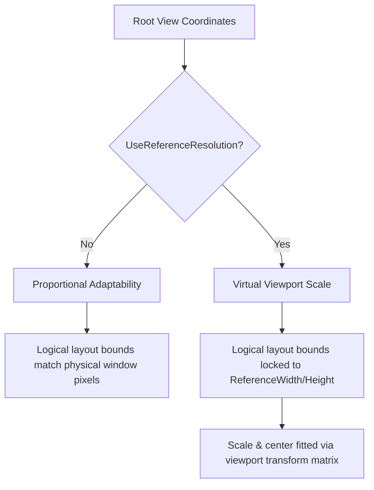

# Blossom UI Layout & Anchoring System

This document outlines the layout engine's anchoring logic, size behaviors, coordinate spaces, and viewport scaling mechanisms implemented in the Blossom rendering framework.

---

## 1. Core Dimensions & Coordinate Spaces

Every UI component in Blossom derives from `VisualElement` and holds a `Transform` class instance (defined in [Transform.cs](file:///home/kozmo/Documents/GitHub/Blossom/src/Visual/Transform.cs)) representing its spatial properties. Layout computation distinguishes between three spaces:

1. **Logical / Design Size (`Local`):** The bounds specified during element construction relative to its parent `(X, Y, Width, Height)`. For example, `new Transform(20, 20, 100, 50)` sets a design position of `X=20`, `Y=20` and size `Width=100`, `Height=50`.
2. **Computed Size (`Computed`):** The final layout coordinates and size in screen/device pixels after solving anchors, scroll offsets, parent offsets, and parent size constraints.
3. **Parent Bounds:** The bounding box of the parent component (`Parent.Computed`). If an element is at the root level, its parent bounds default to the view’s dimensions (either physical window pixels or virtual reference pixels).

---

## 2. Anchors (`Anchor` Flags)

The layout engine uses bitwise flags defined in [Anchor.cs](file:///home/kozmo/Documents/GitHub/Blossom/src/Visual/Enums/Anchor.cs) to anchor element boundaries to their parent's edges:

```csharp
[Flags]
public enum Anchor
{
    None = 0,
    Top = 1,
    Bottom = 2,
    Left = 4,
    Right = 8,
    Horizontal = Left | Right,
    Vertical = Top | Bottom
}
```

### A. The Capture Stage (`SetAnchorValues`)

When an element is initialized, its parent changes, or its local dimensions are programmatically altered, `SetAnchorValues()` runs to capture the design-time relative and absolute spacing from the parent boundaries:

$$FixedLeft = Local.X$$
$$FixedRight = ParentWidth - (Local.X + Local.Width)$$
$$FixedTop = Local.Y$$
$$FixedBottom = ParentHeight - (Local.Y + Local.Height)$$

Relative percentages are also captured to support proportional scaling when no anchors are set:

$$RelativeLeft = \frac{FixedLeft}{ParentWidth}$$
$$RelativeRight = \frac{FixedRight}{ParentWidth}$$
$$RelativeTop = \frac{FixedTop}{ParentHeight}$$
$$RelativeBottom = \frac{FixedBottom}{ParentHeight}$$

> [!NOTE]
> If any local layout properties (`X`, `Y`, `Width`, `Height`) are modified at runtime, the anchor offsets are automatically recalculated to ensure they scale relative to their new layout position.

---

### B. The Solve Stage (`ComputeHorizontalTransform` & `ComputeVerticalTransform`)

During layout updates, coordinates are evaluated relative to the current `ParentWidth` and `ParentHeight` using the equations below:

#### Horizontal Layout Equations

| Anchor Flag Configuration | Computed X | Computed Width | Behavior |
| :--- | :--- | :--- | :--- |
| **`Left` only** | $FixedLeft$ | $Local.Width$ | Stays at a fixed distance from the left edge; maintains constant width. |
| **`Right` only** | $ParentWidth - FixedRight - Local.Width$ | $Local.Width$ | Stays at a fixed distance from the right edge; maintains constant width. |
| **`Left \| Right` (Stretch)** | $FixedLeft$ | $ParentWidth - FixedLeft - FixedRight$ | Spans between left and right offsets; width scales with parent width. |
| **`None` (Proportional)** | $RelativeLeft \times ParentWidth$ | $ParentWidth - (RelativeRight \times ParentWidth) - X$ | Both X coordinate and width scale proportionally to parent width. |

#### Vertical Layout Equations

| Anchor Flag Configuration | Computed Y | Computed Height | Behavior |
| :--- | :--- | :--- | :--- |
| **`Top` only** | $FixedTop$ | $Local.Height$ | Stays at a fixed distance from the top edge; maintains constant height. |
| **`Bottom` only** | $ParentHeight - FixedBottom - Local.Height$ | $Local.Height$ | Stays at a fixed distance from the bottom edge; maintains constant height. |
| **`Top \| Bottom` (Stretch)** | $FixedTop$ | $ParentHeight - FixedTop - FixedBottom$ | Spans between top and bottom offsets; height scales with parent height. |
| **`None` (Proportional)** | $RelativeTop \times ParentHeight$ | $ParentHeight - (RelativeBottom \times ParentHeight) - Y$ | Both Y coordinate and height scale proportionally to parent height. |

---

## 3. Fixed Size Constraints (`FixedWidth` & `FixedHeight`)

By default, when no anchors are specified (`Anchor.None`), elements scale proportionally, which changes both their coordinate placement and dimensions. 

If you want an element to move proportionally with its parent's scale (e.g., maintaining its relative center alignment) but keep its original dimensions (e.g., a centered button that should not stretch into a giant pill shape), enable the **Fixed Size** flags:
* `FixedWidth = true`
* `FixedHeight = true`
* `FixedSize = true` (helper setter that sets both to true)

### Mathematical Resolution

When `FixedWidth = true` and horizontal anchors are `None`, the layout engine first solves the proportional box bounds:

$$X_{prop} = RelativeLeft \times ParentWidth$$
$$Width_{prop} = ParentWidth - (RelativeRight \times ParentWidth) - X_{prop}$$

It then aligns the component centered inside that virtual proportional bounding box while forcing the width back to `Local.Width`:

$$CenterX_{prop} = X_{prop} + \frac{Width_{prop}}{2}$$
$$Computed.X = CenterX_{prop} - \frac{Local.Width}{2}$$
$$Computed.Width = Local.Width$$

This preserves the relative layout center of the component across varying screen widths while preventing unwanted visual stretching.

---

## 4. Reference Resolutions & Viewport Scaling

Views support virtual resolution mapping using three key properties defined in [View.cs](file:///home/kozmo/Documents/GitHub/Blossom/src/Core/View.cs):

```csharp
public bool UseReferenceResolution { get; set; } = false;
public int ReferenceWidth { get; set; } = 1280;
public int ReferenceHeight { get; set; } = 800;
```

This system supports two main execution modes:



### A. Proportional Adaptability (`UseReferenceResolution = false`)
* The logical view size matches the physical window.
* Layout elements compute their bounds directly against actual screen pixels.
* This is suitable for adaptive, fluid dashboard layouts where columns or grids expand to fill the entire workspace.

### B. Virtual Viewport Scale (`UseReferenceResolution = true`)
* The logical view size is locked to `ReferenceWidth` and `ReferenceHeight`.
* An aspect-ratio preserving scale matrix is computed at the root level inside `GetGlobalM44()`:

$$scaleX = \frac{ScreenWidth}{ReferenceWidth}, \quad scaleY = \frac{ScreenHeight}{ReferenceHeight}$$
$$scale = \min(scaleX, scaleY)$$
$$offsetX = \frac{ScreenWidth - ReferenceWidth \times scale}{2}$$
$$offsetY = \frac{ScreenHeight - ReferenceHeight \times scale}{2}$$

* A viewport matrix scales and centers this virtual box inside the window (letterboxing/pillarboxing).
* **UI Builder Benefit:** Ideal for Figma-like canvas editors. Designers lay out elements in a virtual coordinate space (e.g. $1280 \times 800$), and the layout scales automatically to any device without breaking layouts.

---

## 5. Input & Event Coordinate Mapping

When `UseReferenceResolution` is active or 3D rotations/scales are applied, physical mouse click coordinates no longer map 1:1 to logical UI coordinates.

To resolve this, hit-testing in [ElementsMap.cs](file:///home/kozmo/Documents/GitHub/Blossom/src/Core/ElementsMap.cs) retrieves the element's full `GetGlobalM44()` projection matrix and solves a linear system to map the screen point $(x, y)$ back into the local design-space coordinate $(localX, localY)$:

$$\begin{aligned}
(x \cdot m_{30} - m_{00}) \cdot localX + (x \cdot m_{31} - m_{01}) \cdot localY &= m_{03} - x \cdot m_{33} \\
(y \cdot m_{30} - m_{10}) \cdot localX + (y \cdot m_{31} - m_{11}) \cdot localY &= m_{13} - y \cdot m_{33}
\end{aligned}$$

This linear system is solved using Cramer's Rule:

$$D = A_1 B_2 - B_1 A_2$$
$$localX = \frac{C_1 B_2 - B_1 C_2}{D}, \quad localY = \frac{A_1 C_2 - C_1 A_2}{D}$$

If the solved point lies within the element's local bounds $[0, Width] \times [0, Height]$ (and is not outside its border roundness), a hit is recorded. This ensures hover states, scroll offsets, and click events work accurately at any display scale or layout distortion.

---

## 6. Layout Propagation & Life Cycle

The layout evaluation follows a top-down propagation flow:

1. **Dirty Marking:** If the window is resized, `Browser.WasResized` becomes true, marking `_transformDirty` across layout nodes. Programmatically setting `X`, `Y`, `Width`, or `Height` also dirtying the local node.
2. **Evaluation (`Evaluate()`):** During the loop cycle, `Evaluate()` checks if `_transformDirty` is true. If so, it recalculates coordinates and dimensions.
3. **Child Propagation:** If the solved computed bounding box changes, the element marks all of its immediate children as `_transformDirty = true` and schedules them for layout and rendering updates.
